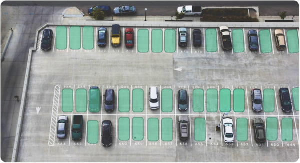

import Divider from "../components/divider"
import SectionProject from "../components/sectionProject"
const data = ["one", "two"]

#### Система видеоанализа и оповещения свободных мест на паркинге.

##### Программная реализация системы размещена на виртуальной машине Интернет-провайдера и готова к тестированию.

<Divider />

Собственная разработка • Масштабирование • Кастомизация • Нет аналогов в СНГ

<Divider />

### Задача:

Определение свободных мест на парковке и информирование автовладельцев об их наличии

<Divider />

<Divider />

### Особенности решения:

- Более 98% вероятность определения свободного места на автостоянке (паркинге) нейросетью глубокого обучения
- Адаптация к любым автостоянкам и улучшений показателей благодаря возможности обучения.
- Наличие свободных мест оценивается по мгновенным снимкам видеокамер, не препятствуя работе системы видеонаблюдения;
- Для сложной конфигурации автостоянок с установленными несколькими видеокамерами имеется возможность определения границ зоны действия каждой из камер;
- Ручная разметка или автоматическое определение стояночных мест;
- Фиксирование нарушений правил стоянки – загораживание проезда, стоянка автомобиля на тротуаре;
- Информирование автовладельцев о наличии свободных мест на автостоянках (паркингах) в зоне локации посредством мобильного приложения.

<Divider />

- 65% уменьшение количества нарушений правил парковки в часы пик
- 60% уменьшение среднего времени парковки
- 83% снижение количества нарушений правил парковки
- 300% рост показателя оборачиваемости парковки

<Divider />

### Эффект от реализации

- Создание оптимального баланса между загрузкой придорожных и закрытых парковок
- Борьба с долгосрочной парковкой
- Снижение количества нарушений правил дорожного движения
- Снижение транспортной нагрузки
- Пополнение бюджета города

<Divider />
